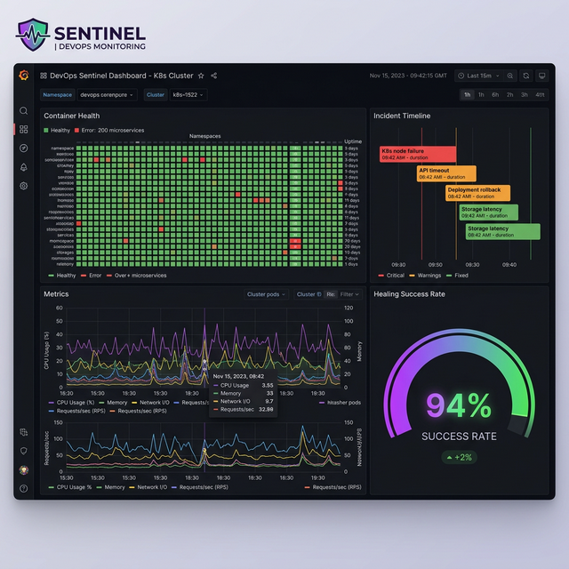

# Grafana & Alertmanager Integration Guide

Sentinel integrates with the Prometheus ecosystem by exporting metrics for Grafana and ingesting alerts from Alertmanager to trigger AI investigations.

## 📊 Grafana Dashboard

Sentinel provides a pre-built Grafana dashboard to visualize container health, incident timelines, and AI analysis results.

### Import Instructions

1. Open your Grafana instance.
2. Navigate to **Dashboards** > **New** > **Import**.
3. Copy and paste the contents of `sentinel-frontend/public/grafana-dashboard.json` or upload the file.
4. Select your **Prometheus** data source.
5. Click **Import**.

### Dashboard Features

- **Container Health Heatmap**: Visualizes the status of all managed containers using `sentinel_container_health`.
- **Incident Timeline**: Correlates Prometheus alerts with Sentinel AI investigations.
- **AI Accuracy & Healing Success**: A gauge showing the ratio of successful resolutions to total incidents.
- **MTTR Trend**: Tracks Resolution Rate over time to measure system recovery efficiency.


*Figure 1: The enhanced Sentinel Grafana dashboard showing health heatmap and AI insights.*

---

## 🔔 Alertmanager Webhook Receiver

Sentinel can ingest alerts from Alertmanager to trigger automated AI investigations and logging.

### Configuration

1. **Security Token**: Generate a secure string and set it as `ALERTMANAGER_SECRET` in your Sentinel `.env` file.
2. **Alertmanager Setup**: Add the following receiver configuration to your `alertmanager.yml`, ensuring you include the `token` parameter.

```yaml
receivers:
- name: 'sentinel-webhook'
  webhook_configs:
  - url: 'http://<sentinel-backend-host>:4000/api/webhooks/alertmanager'
    http_config:
      headers:
        X-Sentinel-Token: '<YOUR_SECRET_TOKEN>'
    send_resolved: true

route:
  group_by: ['alertname', 'instance']
  receiver: 'sentinel-webhook'
```

### How it Works
...

1. **Alert Firing**: When Prometheus detects an issue (e.g., High CPU), Alertmanager sends a webhook to Sentinel.
2. **Sentinel Ingestion**: Sentinel receives the alert, logs it in the activity feed, and creates a "Prometheus Investigation" incident.
3. **AI Investigation**: Sentinel's AI (via Kestra or internal logic) analyzes the alert context and provides insights on the dashboard.
4. **Resolution**: When the alert is resolved, Alertmanager sends a "resolved" status, which Sentinel logs as a success.

---

## 🛠️ Troubleshooting

- **Webhook not received**: Ensure the Sentinel backend is accessible from the Alertmanager network.
- **Metrics not appearing**: Verify that Sentinel's `/metrics` endpoint is being scraped by Prometheus.
- **AI Investigation not triggered**: Check the backend logs for `[ALERTMANAGER]` entries and verify Kestra connectivity if applicable.
